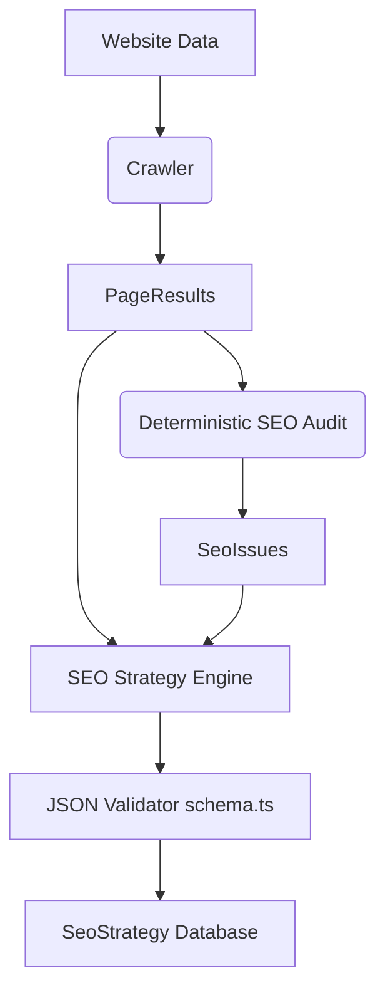

# AI SEO Strategy Engine

The **AI SEO Strategy Engine** (Step 6E-4) sits at the peak of the deterministic SEO audit pipeline. It interprets the crawled website data and deterministic audit flags to generate an actionable, strictly structured roadmap using Google Gemini (via the `AiProvider`).

## Architecture

## Prompt Design
The prompt is defined in `apps/api/src/services/seoStrategy/prompt.ts`.
It aggressively enforces **no-fabrication** constraints:
- "Never invent metrics, rankings, traffic, search volume, keyword difficulty, backlinks, competitors, or page properties that are not present in the supplied data."
- Requests output exactly conforming to the `SeoStrategyOutput` TypeScript interface schema.

## Output Schema
The schema strictly organizes the output into:
- `executiveSummary`
- `priorityActions` (requires an explicit CRITICAL, HIGH, MEDIUM, LOW priority)
- `keywordStrategy` (assigns intent to supplied keywords)
- `contentStrategy`
- `internalLinkingStrategy`
- `technicalStrategy`
- `backlinkStrategy`

## Limits & Truncation
To avoid overloading Gemini's token limits and ensuring lightning-fast latency:
- Maximum 30 Pages (ordered by crawl depth, prioritizing homepage & core pages)
- Maximum 50 SEO Issues (ordered strictly by `CRITICAL -> HIGH -> MEDIUM -> LOW`)

## Failures & Safety
- **No JSON Fabrication:** If Gemini fails to return JSON matching the strict schema, the job halts, logs `FAILED`, and never overwrites the user's dashboard with garbage.
- **Tenant Isolation:** Data ownership is strictly enforced via `websiteId` bound to `req.user.id`.
- **Competitor Constraints:** Explicitly stated in the UI: *"Competitor intelligence will be added when competitor data is connected."* No fake companies are generated.
